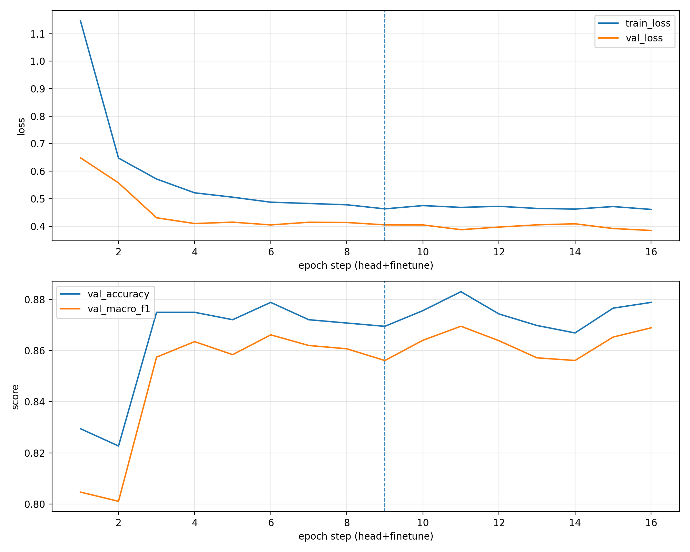
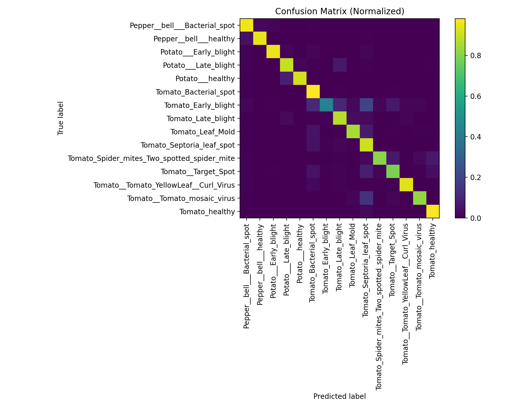
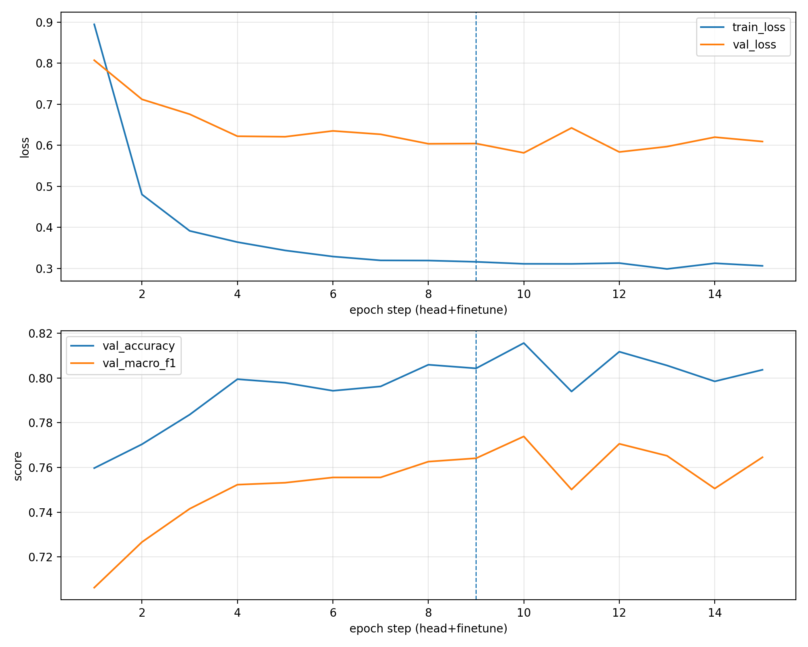
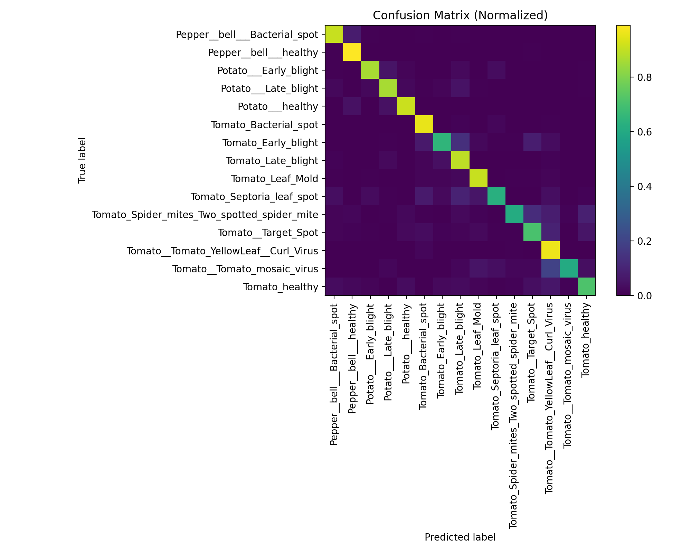
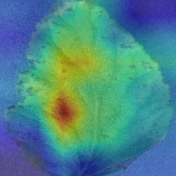

# 🌿 PlantVillage Disease Classification
*A deep learning pipeline for plant leaf disease recognition using CNNs and transfer learning.*

--- 

## 📌 Project Overview

This project presents an end-to-end image classification pipeline for plant leaf disease identification using the **PlantVillage** dataset. The pipeline covers the full machine learning workflow, from dataset preprocessing to quantitative evaluation and visual interpretability analysis.

We investigate the performance of two convolutional neural network (CNN) architectures under a transfer learning setting:

- **ResNet-18**, leveraging residual connections for stable optimization  
- **EfficientNet-B0**, employing compound scaling for parameter-efficient learning  

Both models are fine-tuned from ImageNet-pretrained weights and evaluated under a consistent experimental setup to enable fair comparison.

The proposed pipeline consists of the following components:

- **Dataset preprocessing and stratified splitting** into training, validation, and test subsets  
- **Model training and fine-tuning**, including a two-phase optimization strategy  
- **Quantitative evaluation**, reporting accuracy, macro-averaged F1 score, and confusion matrices  
- **Qualitative model interpretability** using Grad-CAM visualizations to highlight discriminative image regions  
- **Automated result visualization and experiment archiving**, ensuring reproducibility across model variants  

This repository is designed to be modular and extensible, allowing additional architectures or datasets to be incorporated with minimal changes to the codebase.

---

## 🗂 Dataset

**Dataset:** PlantVillage  
**Source:** https://www.kaggle.com/datasets/emmarex/plantdisease/data  

After downloading, place the dataset at:

`data/raw/PlantVillage/`

### Summary

- **Number of classes:** 15  
- **Total images:** ~20,600  
- **Image format:** RGB, mostly 256×256  
- **Split ratio:**  
  - Train: 70%  
  - Validation: 15%  
  - Test: 15%

### Classes (15)

Pepper (bell):
- Bacterial spot  
- Healthy  

Potato:
- Early blight  
- Late blight  
- Healthy  

Tomato:
- Bacterial spot  
- Early blight  
- Late blight  
- Leaf mold  
- Septoria leaf spot  
- Spider mites (Two-spotted spider mite)  
- Target spot  
- Tomato yellow leaf curl virus  
- Tomato mosaic virus  
- Healthy  

---

## 🧠 Models

### ResNet-18 (Baseline Transfer Learning)

- Pretrained on ImageNet
- Two-phase training:
  - Phase 1: Train classifier head only
  - Phase 2: Fine-tune full network with reduced learning rate

### EfficientNet-B0 (Baseline Transfer Learning)

- Pretrained on ImageNet
- Same training strategy and hyperparameters as ResNet-18  
  (ensures **fair comparison**)

---

## ⚙️ Training Setup

- **Framework:** PyTorch
- **Device:** Apple M1 Max (32GB RAM)
- **Accelerator:** MPS
- **Optimizer:** AdamW
- **Loss:** Cross-Entropy
- **Early stopping:** Enabled
- **Image size:** 224×224
- **Normalization:** ImageNet mean & std

⏱ **Approximate training time per model:**  
~30 minutes (early stopped)

---

## 📊 Results

Final evaluation is performed on the **held-out test set**.

### Quantitative Metrics

| Model | Test Accuracy | Macro-F1 | Top-3 Accuracy |
|------|---------------|----------|---------------|
| ResNet-18 | ~0.883 | ~0.870 | ~0.977 |
| EfficientNet-B0 | ~0.816 | ~0.774 | ~0.948 |

> Exact metrics are stored in each model’s `results.json`.

---

### ResNet-18 — Training Curves, Confusion Matrix, Errors

<p align="center">
  
  
  
</p>

---

### EfficientNet-B0 — Training Curves, Confusion Matrix, Errors

<p align="center">
  
  
  
</p>

---

## 🧠 Model Explainability — Grad-CAM

Grad-CAM highlights image regions that most influenced the model’s prediction.

### Example (ResNet-18)


### Example (EfficientNet-B0)


Full Grad-CAM galleries:
- `reports_archive/reports_20260126_143813_resnet18/figures/gradcam/`
- `reports_archive/reports_20260126_151938_efficientnet/figures/gradcam/`

---

## 🧪 Reproducibility

### Install Dependencies

```bash
pip install -r requirements.txt
```

### Run Full Pipeline

```bash
chmod +x scripts/run_all.sh
./scripts/run_all.sh
```

### Switch Models

To switch models, change **one line only** in `scripts/run_all.sh`:

```bash
CONFIG=configs/resnet18.yaml
# CONFIG=configs/efficientnet_b0.yaml
```

---

## 📁 Project Structure

```text
configs/                # Model & training configs
src/
├── data/               # Dataset, transforms, splits
├── models/             # CNN & transfer models
├── explain/            # Grad-CAM
├── train.py
├── eval.py
├── visualize.py
reports_archive/        # Timestamped experiment outputs
scripts/
requirements.txt
README.md
```

---

## ⚠️ Limitations

- **Clean background bias**: Images are captured under controlled conditions.
- **No real-world field images**: Limited lighting and background diversity.
- **Generalization risk**: Performance may degrade in real agricultural environments.

---

## 🚀 Future Work

- Add real-world field datasets  
- More realistic data augmentation  
- Additional crop species  
- Model ensembling  
- Lightweight deployment (ONNX / CoreML)  
- Prediction uncertainty estimation


